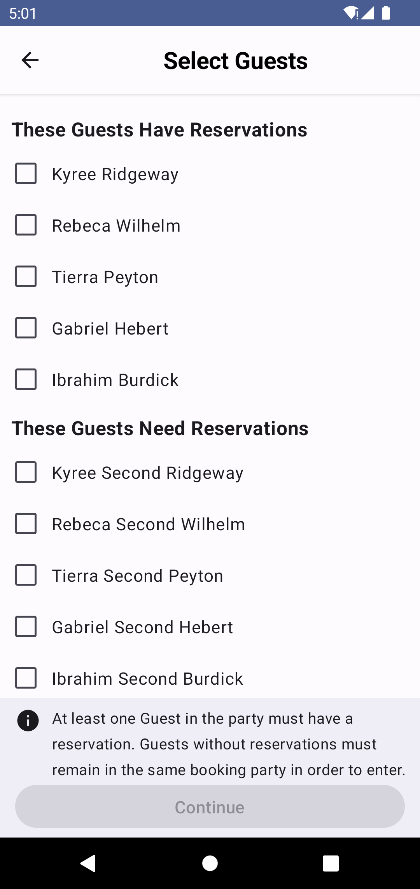
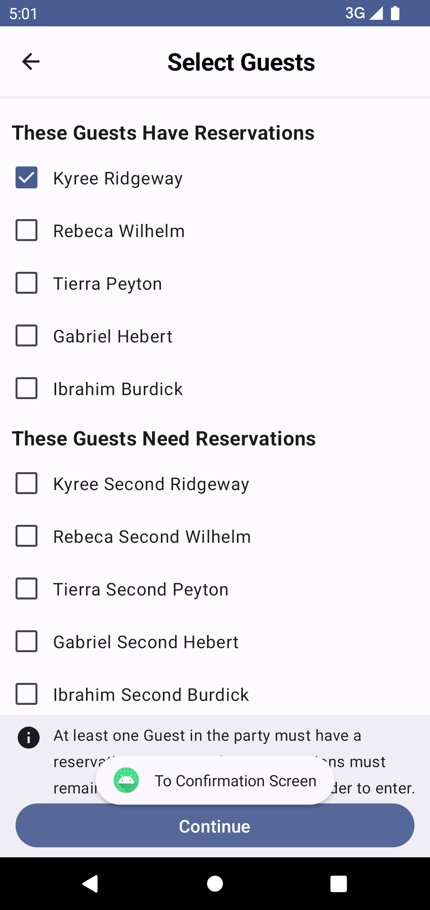
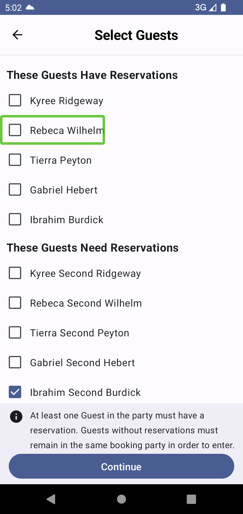

# Example
 Online challenge
 
 An example project to create an intuitive booking app which will respond in accordance to the input.
 Implemented in jetpack compose using Hilt dependency injection and Raamcosta compose destination library ( https://github.com/raamcosta/compose-destinations ).
 Accessibility features updated to utilize TalkBack in a comfortable manner.
 

